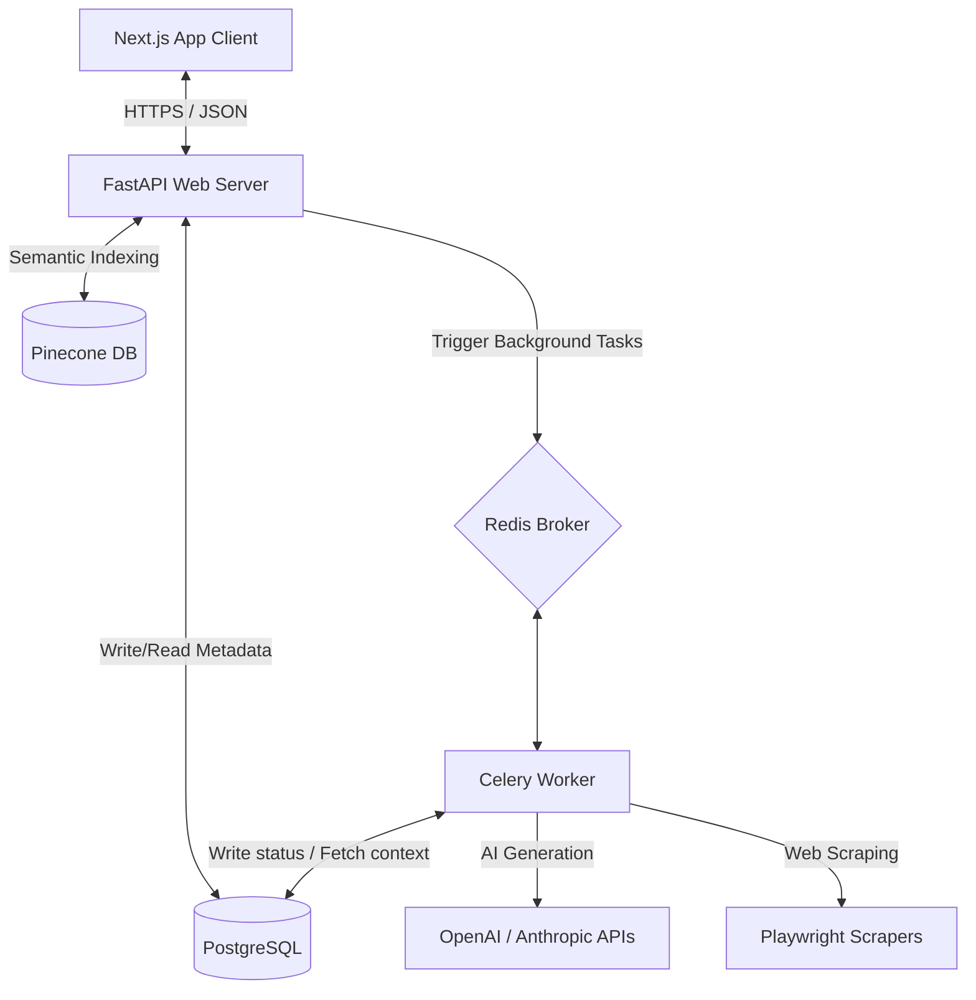

# EuroGrant AI

> **AI-Powered EU Grant & Public Tender Automation for SMEs**

EuroGrant AI is a B2B SaaS project for grant discovery, semantic matching, document processing, and assisted proposal drafting for European SMEs.

The repository demonstrates a security-conscious, asynchronous full-stack architecture. Product outcomes and processing-time claims are treated as targets until they are validated with production usage.

---

[](https://fastapi.tiangolo.com/)
[](https://nextjs.org/)
[](https://docs.celeryq.dev/)
[](https://redis.io/)
[](https://www.postgresql.org/)
[](https://www.pinecone.io/)

---

## 🚀 Key Features

*   **Semantic Grant Matching:** Utilizes Pinecone vector database to semantic-match company profiles with all open EU public tenders and grants.
*   **Automated Proposal Generation:** Leverages advanced RAG pipelines (OpenAI & Anthropic) to generate comprehensive grant proposals matching specific EU call rubrics.
*   **Asynchronous Processing:** Multi-worker architecture handling long-running AI generation and background web-scraping jobs.
*   **Security-Conscious Architecture:** Includes trusted-host validation, CSRF controls, rate limiting, security headers, and restricted container privileges.
*   **Internationalized Frontend:** English and German application routes through `next-intl`.

---

## 🏗️ System Architecture

EuroGrant AI utilizes a decoupled **Message Queue / Worker Architecture** to handle long-running AI inference, semantic search, and web scraping:



1.  **FastAPI (Web Gateway):** Handles immediate REST requests, user authentication, and serving metadata.
2.  **Redis (Message Broker):** Manages task distribution queues.
3.  **Celery Workers (Processor):** Execute long-running tasks, including web scraping (using Playwright) and proposal generation.
4.  **Pinecone (Vector Database):** Provides high-dimensional vector search to matching company profiles against grant databases.

---

## 📂 Project Structure

```text
├── backend/            # FastAPI Backend Application
│   ├── app/            # Main application modules (models, routers, services, worker)
│   ├── alembic/        # Database migrations database scheme
│   ├── tests/          # Pytest backend test suite
│   └── Dockerfile      # Backend service image definition
├── frontend/           # Next.js 14 Web Application
│   ├── src/            # Components, pages, hooks, state, etc.
│   ├── tests/          # Frontend testing configurations & test suites
│   └── Dockerfile      # Frontend service image definition
├── planning/           # GSD Roadmap, Requirements, & Architecture Docs
└── docker-compose.yml  # Multi-container local orchestration configuration
```

---

## 🚦 Getting Started (Local Development)

### Prerequisites

Make sure you have the following installed on your machine:
*   [Docker & Docker Compose](https://www.docker.com/)
*   [Node.js 20+](https://nodejs.org/)
*   [Python 3.11+](https://www.python.org/)

### Quick Start (Using Docker Compose)

1.  **Clone the Repository:**
    ```bash
git clone https://github.com/Vaibhavtiwari-dev/eurogrant-ai.git
cd eurogrant-ai
    ```

2.  **Environment Variables Setup:**
    *   Create a local `.env` file in the `backend/` directory:
        ```bash
        cp backend/.env.example backend/.env
        ```
        Fill in the required database credentials, Pinecone keys, and LLM provider tokens.
    *   Create a `.env.local` file in the `frontend/` directory:
        ```bash
        echo "NEXT_PUBLIC_API_URL=http://localhost:8000" > frontend/.env.local
        ```

3.  **Run the entire stack:**
    ```bash
    docker-compose up --build
    ```
    This command spins up the following services:
    *   `backend` at [http://localhost:8000](http://localhost:8000) (Interactive Swagger Docs at `/docs`)
    *   `frontend` at [http://localhost:3000](http://localhost:3000)
    *   `db` (Postgres database on port `5432`)
    *   `redis` (Redis message broker on port `6379`)
    *   `worker` (Asynchronous Celery worker)
    *   `beat` (Scheduled Celery tasks scheduler)

---

## 🧪 Testing

### Backend tests
To run the Python test suite, execute:
```bash
cd backend
python -m pytest
```

### Frontend tests
To run the Next.js unit and integration tests:
```bash
cd frontend
npm run test
```

To run Playwright E2E tests:
```bash
cd frontend
npx playwright test
```

---

## ⚖️ License & Proprietary Notice

**Copyright (c) 2026 EuroGrant AI. All Rights Reserved.**

This software and associated documentation files are proprietary and confidential. Unauthorized copying, distribution, modification, or reuse of any portion of this system is strictly prohibited.

