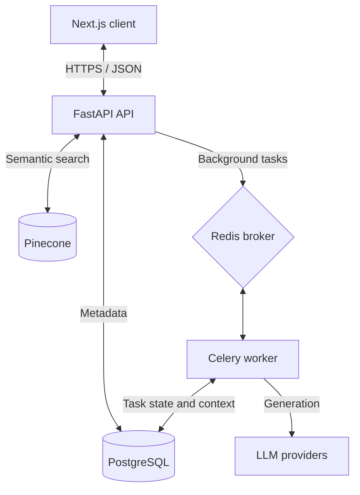

# EuroGrant AI

> **AI-Powered EU Grant & Public Tender Automation for SMEs**

EuroGrant AI is a B2B SaaS project for grant discovery, semantic matching, document processing, and assisted proposal drafting for European SMEs.

The repository demonstrates a security-conscious, asynchronous full-stack architecture. Product outcomes and processing-time claims are treated as targets until they are validated with production usage.

---

[](https://fastapi.tiangolo.com/)
[](https://nextjs.org/)
[](https://docs.celeryq.dev/)
[](https://redis.io/)
[](https://www.postgresql.org/)
[](https://www.pinecone.io/)

---

## Key Features

- **Semantic Grant Matching:** Uses Pinecone to match organization profiles with grant opportunities.
- **Assisted Proposal Generation:** Uses retrieval and LLM services to draft proposal content against grant requirements.
- **Asynchronous Processing:** Runs long document and AI workloads through Celery and Redis.
- **Security-Conscious Architecture:** Includes trusted-host validation, CSRF controls, rate limiting, security headers, and restricted container privileges.
- **Internationalized Frontend:** Provides English and German application routes through `next-intl`.

---

## System Architecture

EuroGrant AI uses a message-queue and worker architecture for long-running inference, semantic search, and document-processing work:



## Project Structure

```text
|-- backend/            FastAPI application, migrations, workers, and tests
|-- frontend/           Next.js application, unit tests, and Playwright tests
|-- nginx/              local reverse-proxy configuration
|-- security-reports/   security assessment artifacts
|-- docker-compose.yml  local multi-container orchestration
`-- README.md
```

## Getting Started

### Prerequisites

- Docker and Docker Compose
- Node.js 20+
- Python 3.11+

```bash
git clone https://github.com/Vaibhavtiwari-dev/EuroGrant--AI.git
cd EuroGrant--AI
cp backend/.env.example backend/.env
docker compose up --build
```

Configure the required database, Redis, Pinecone, storage, and LLM credentials in `backend/.env` before starting the stack.

Local services include:

- Frontend: `http://localhost:3000`
- Backend: `http://localhost:8000`
- API documentation: `http://localhost:8000/docs`
- PostgreSQL, Redis, Celery worker, Celery beat, and Nginx

## Testing

```bash
# Backend
cd backend
python -m pytest

# Frontend unit tests
cd ../frontend
npm run test:unit

# Frontend end-to-end tests
npm run test:e2e
```

## License and Proprietary Notice

**Copyright (c) 2026 EuroGrant AI. All Rights Reserved.**

This software and associated documentation are proprietary. Unauthorized copying, distribution, modification, or reuse is prohibited.
